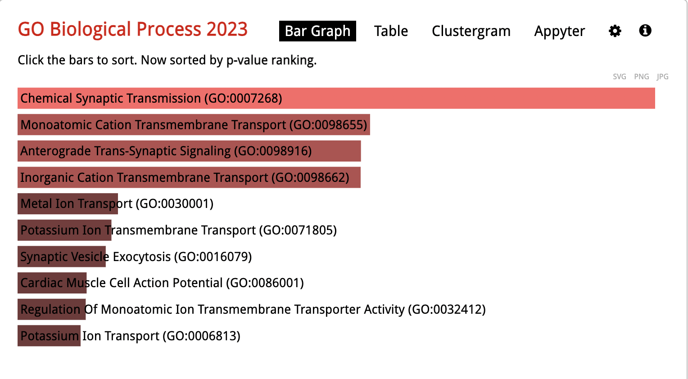

```{r setup, include=FALSE}
knitr::opts_chunkset(echo = T, 
                      warning = F, 
                      message = F)
```

```{r tema, include=FALSE}
if(!require(rmdformats)) install.packages("rmdformats",repos = "http://cran.us.r-project.org")
# Laster ned pakken med formatet for dokumentet i tilfelle pakken ikke allerede er installert
```

```{r libraries}
library(tidyverse)
```

## Data
The data is from people with autism and control group

Reading the data, from a folder with data, into a matrix
```{r }
samples <- list.files("Data/htseq/htseq/")

counts <- tibble()
for (sample in samples) {
  file <- paste0("htseq/", sample)
  
  sample.trimmed <- gsub(".txt", "", sample)
  
  c <- read_tsv(file, col_names = FALSE, comment = "__") %>%
    rename(Gene = X1, !!sym(sample.trimmed) := X2)
  
  if (sample == samples[1]) {
    counts <- c 
  } else {
    counts <- cbind(counts, c %>% select(-Gene))
  }
}

counts <- counts %>% 
  column_to_rownames(var = "Gene") %>% 
  as.matrix()
```

## Differental expression between autism and controls in cortex
Makes a DEseq dataset (dds) and analyses differential expression between autism and control
```{r }
# Read in RNA-Seq count data and design
dds <- DESeq2::DESeqDataSetFromMatrix(
  countData = counts,
  colData = data.frame(condition = factor(c("autism", "autism", "autism",
                                            "control", "control", "control"), 
                                          levels = c("control","autism"))),
  design = ~ condition)
```

Variance stabilizing transformation (vst)
```{r }
vst <- DESeq2::varianceStabilizingTransformation(counts)
```

Does the DEseq analysis
```{r }
dds <- DESeq2::DESeq(dds)
```

Shows the results as data frame
```{r }
res <- DESeq2::results(dds)
as.data.frame(res)[1:10,]
```

Box plot of expression levels for controll and phenotype
```{r }
Expression <-  vst["ENSG00000000003",]
Phenotype <-  dds$condition

tibble(Expression, Phenotype) %>% 
  ggplot(aes(x = Phenotype,
             y = Expression,
             color = Phenotype)) +
  geom_boxplot() +
  geom_jitter() +
  scale_color_manual(values = c("black", "red")) +
  theme_minimal() +
  theme(panel.border = element_rect(fill=NA))
```

## MA plot 
MA plot
```{r }
MA <- data.frame(res)

MA %>% 
  mutate(DEG = padj < 0.05) %>% 
  filter(log2FoldChange > -10 & log2FoldChange < 10) %>%
  drop_na(log2FoldChange) %>% 
  ggplot(aes(x = baseMean,
             y = log2FoldChange,
             color = DEG)) +
  geom_point() +
  scale_x_log10() +
  scale_color_manual(values = c("grey", "blue")) +
  theme_minimal() +
  theme(panel.border = element_rect(fill=NA))
```

## Vulcano plot
Vulcanoplot
```{r }
data.frame(res) %>% 
  mutate(DEG = padj < 0.05) %>% 
  filter(log2FoldChange > -10 & log2FoldChange < 10) %>%
  drop_na(padj) %>% 
  ggplot(aes(x = log2FoldChange,
             y = -log10(padj),
             color = DEG)) +
  geom_point() +
  scale_color_manual(values = c("grey", "blue")) +
  theme_minimal() +
  theme(panel.border = element_rect(fill=NA))
```

## FC cuttoff
New table with padj < 0.05 and expression values that are either dobble or half that of the control condition. 
```{r }
data.frame(res) %>% 
  filter(padj < 0.05) %>% 
  filter(abs(log2FoldChange) > 1) %>% 
  arrange() -> res0.05FC
```

## GO inrichment
Ontology terms
```{r }
GO <- read_tsv("Data/Human_ensembl_ids_to_symbols.txt")
```

Finding the upregulated and downregulated genes
```{r }
upreg <- res0.05FC %>% 
  filter(log2FoldChange > 0) %>% 
  rownames_to_column(var = "ensembl_id") %>% 
  select("ensembl_id") %>% 
  left_join(GO, by = "ensembl_id") %>% 
  select(gene_symbol)

write_lines(upreg$gene_symbol, file = "upreg.txt")
  

downreg <- res0.05FC %>% 
  filter(log2FoldChange < 0) %>% 
  rownames_to_column(var = "ensembl_id") %>% 
  select("ensembl_id") %>% 
  left_join(GO, by = "ensembl_id") %>% 
  select(gene_symbol)

write(downreg$gene_symbol,file = "downreg.txt")
```

Upregulated from GO analysis
```{r }

```

Downregulated from GO analysis
```{r }

```